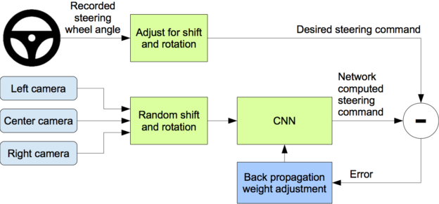

# Obstacle detection and avoidance using End-toEnd Learning
## PFE / Cristal-University of Lille
---
### Author : Akeniouene Abderrahmane
---

This project is an imlementation of the NVIDIA end-to-end learning for self driving cars.
This implementation is made with `Pytorch` instead of `Tensorflow` because of the ease of using `cuda`.

End to end learning is an algorithm by Nvidia for imitation learning.
The algorithm takes as input images from the front of the vehicle and
processes those images in association with the steering angle.
After the training process, the model will be able to predict the steering angle associated to images token as input.

The desired goal in the whole training process is to minimize the loss function, which is the `MSELoss`, it calculates the loss between the truth values and the results predicted by our model.


|  | 
|:--:| 
| *Training Process* |
     

|  | 
|:--:| 
| *Testing Process* |

## Model architecture
---

- Normalization
- Convolution: 5x5, filter: 24, strides: 2x2, activation: ELU
- Convolution: 5x5, filter: 36, strides: 2x2, activation: ELU
- Convolution: 5x5, filter: 48, strides: 2x2, activation: ELU
- Convolution: 3x3, filter: 64, activation: ELU
- Convolution: 3x3, filter: 64, activation: ELU
- Flatten
- FCL : 100, activation: ELU
- FCL:  50, activation: ELU
- FCL:  10, activation: ELU
- FCL:  1

|  | 
|:--:| 
| *CNN architecture. The network has about 27 million connections and 250 thousand parameters* |

## Training and testing
---

I use the <a href="https://github.com/udacity/self-driving-car-sim">Udacity’s Self-Driving Car Simulator</a> built on Unity, which i modified by adding some random obstacles of diferent size and position.


|  | 
|:--:| 
| *Image from the training process - Track 1s* |

# Run
Create a new environement and install the following (check `pytorch-awesome` environment): 
````
    python3
    numpy
    matplotlib
    pytorch
    opencv
    pillow
    scikit-learn
    scikit-image
    scipy
    h5py
    eventlet
    flask-socketio
    pandas
    imageio
    moviepy
````


Running the simulator:
----

- Run my version of the Udacity Self-Driving car simulator (for example : simulators/simulation_linux_3.x86_64).
- Select Track 1 which coreseponds to the track with the added obstacles.
- By selecting the training mode, you can drive the car, don't forget to record. (press `R`)
- After finishing the drive recording, you can quit and check for the target folder you chose to save the data in, you should find a file named `driving_log.csv` and an `IMG` folder containing the images of the three cameras.


Training the model:
---
Before following the coming instructions, make sure to activate your environement.

````
python3 train.py -d <data directory>
````


In order to change the training parameters for the training process, you can change the parameters by using the following commands.

In order to change the epoch count:(Default is 10)
````
python3 train.py -d <data directory> -n <change to new epoch count>
````
In order to change the batch size:(Default is 64)

````
python3 train.py -d <data directory> -b <change to new batch size>
````
In order to change the learning rate:(Default is 10e-4)

````
python3 train.py -d <data directory> -l <change to new learning rate>
````

Testing the trained models
---
Multiple trained models will be stored in a folder called `models` while trainig.

To test any model:
- Launch the simulator.
- Select the `Autonomous mode` and then run the following command:
    - ```
        python3 drive.py <path to model>
        ```
    - you can record by addibng a `<directory>` just after the command line above.

     for example :
          
     ```
          python3 drive.py models/model_490000 d
     ```
# Bibliography

- https://arxiv.org/pdf/1604.07316v1.pdf
- https://arxiv.org/pdf/1704.07911.pdf
- https://github.com/udacity/self-driving-car-sim
